# Capital One Data Science Challenge 

By Cliff Green

## Introduction 
- Today I will be exploring data provided The New York City Taxi & Limosine Commission. The NYU TLC aggregated trip data recorded during recorded by technology providers implemented under the Taxicab & Livery Passenger Enhancement Program. It is important to note that the TLC does not guarantee accuracy of the data provided. There are three main type of services offered by Taxi Cabs in New York. The first is the Yellow line which only provides transportation through off the street hails. The second is FHVs which exclusively works with prearranged trips, this includes a limo service. The third method is a green cab which can accept street hails above 110th street and in out boroughs but can only pick up prearranged rides when not in those established areas. Let’s see what fun things we can learn!


Prior to any analysis, I think it’s important to understand the data, and each variable in the dataset. A thorough explanation can be found here. http://www.nyc.gov/html/tlc/downloads/pdf/data_dictionary_trip_records_green.pdf

First I import the required libraries, pandas for dataframes, request/io for pulling stuff offline, matplot for data visualization and numpy for math functions


```python
#I was pretty ambition with what I thought I was going to use
import sys
import pandas as pd
import requests, io
import matplotlib
import folium #map visualization
from folium import plugins
import matplotlib.pyplot as plt
import numpy as np
import scipy.stats as stats
import sklearn
from sklearn.ensemble import RandomForestClassifier
from sklearn import linear_model
import statsmodels.api as sm
import seaborn as sns
import warnings
warnings.filterwarnings('ignore')
%matplotlib inline
```

# Question 1
  - Programmatically download and load into your favorite analytical tool the trip data for September 2015.
  
  - Report how many rows and columns of data you have loaded.

## Part 1

Downloading the Data and Loading into Python:


```python

url = 'https://s3.amazonaws.com/nyc-tlc/trip+data/green_tripdata_2015-09.csv'
s = requests.get(url).content
SeptData = pd.read_csv(io.StringIO(s.decode('iso-8859-1')))
```

## Part 2

Counting Rows and Columns

```python

SeptData.shape[1]
#number of columns- 21
SeptData.shape[0]
#number of rows - 1494926
```

This Dataset has 1494926 rows and 21 columns

# Question 2
   - Plot a histogram of the number of the trip distance ("Trip Distance").
    
   - Report any structure you find and any hypotheses you have about that structure.


##### Using the code shown below I created a quick histogram from the data.


```python
%matplotlib inline #shows plots inline
SeptData['Trip_distance'].hist(bins=20 )# creating a histogram for trip distance
plt.suptitle('Histogram of Travel Distance', fontsize=20)
plt.xlabel('Distance', fontsize=18)
plt.ylabel('Occurrences ', fontsize=16)
```


    <matplotlib.text.Text at 0x28bdfde5780>


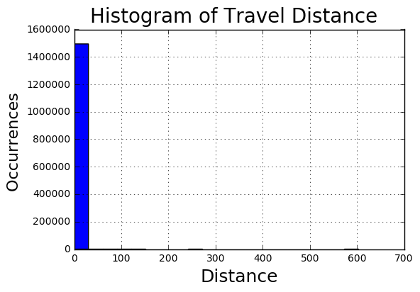


Obviously, the figure tells us very little about the actual dataset, so some cleaning is necessary. The first thing I did was look at the distribution of each variable


```python
SeptData.describe()
```


<div>
<table border="1" class="dataframe">
  <thead>
    <tr style="text-align: right;">
      <th></th>
      <th>VendorID</th>
      <th>RateCodeID</th>
      <th>Pickup_longitude</th>
      <th>Pickup_latitude</th>
      <th>Dropoff_longitude</th>
      <th>Dropoff_latitude</th>
      <th>Passenger_count</th>
      <th>Trip_distance</th>
      <th>Fare_amount</th>
      <th>Extra</th>
      <th>MTA_tax</th>
      <th>Tip_amount</th>
      <th>Tolls_amount</th>
      <th>Ehail_fee</th>
      <th>improvement_surcharge</th>
      <th>Total_amount</th>
      <th>Payment_type</th>
      <th>Trip_type</th>
    </tr>
  </thead>
  <tbody>
    <tr>
      <th>count</th>
      <td>1.494926e+06</td>
      <td>1.494926e+06</td>
      <td>1.494926e+06</td>
      <td>1.494926e+06</td>
      <td>1.494926e+06</td>
      <td>1.494926e+06</td>
      <td>1.494926e+06</td>
      <td>1.494926e+06</td>
      <td>1.494926e+06</td>
      <td>1.494926e+06</td>
      <td>1.494926e+06</td>
      <td>1.494926e+06</td>
      <td>1.494926e+06</td>
      <td>0.0</td>
      <td>1.494926e+06</td>
      <td>1.494926e+06</td>
      <td>1.494926e+06</td>
      <td>1.494922e+06</td>
    </tr>
    <tr>
      <th>mean</th>
      <td>1.782045e+00</td>
      <td>1.097653e+00</td>
      <td>-7.383084e+01</td>
      <td>4.069114e+01</td>
      <td>-7.383728e+01</td>
      <td>4.069291e+01</td>
      <td>1.370598e+00</td>
      <td>2.968141e+00</td>
      <td>1.254320e+01</td>
      <td>3.512800e-01</td>
      <td>4.866408e-01</td>
      <td>1.235727e+00</td>
      <td>1.231047e-01</td>
      <td>NaN</td>
      <td>2.920991e-01</td>
      <td>1.503215e+01</td>
      <td>1.540559e+00</td>
      <td>1.022353e+00</td>
    </tr>
    <tr>
      <th>std</th>
      <td>4.128570e-01</td>
      <td>6.359437e-01</td>
      <td>2.776082e+00</td>
      <td>1.530882e+00</td>
      <td>2.677911e+00</td>
      <td>1.476698e+00</td>
      <td>1.039426e+00</td>
      <td>3.076621e+00</td>
      <td>1.008278e+01</td>
      <td>3.663096e-01</td>
      <td>8.504473e-02</td>
      <td>2.431476e+00</td>
      <td>8.910137e-01</td>
      <td>NaN</td>
      <td>5.074009e-02</td>
      <td>1.155316e+01</td>
      <td>5.232935e-01</td>
      <td>1.478288e-01</td>
    </tr>
    <tr>
      <th>min</th>
      <td>1.000000e+00</td>
      <td>1.000000e+00</td>
      <td>-8.331908e+01</td>
      <td>0.000000e+00</td>
      <td>-8.342784e+01</td>
      <td>0.000000e+00</td>
      <td>0.000000e+00</td>
      <td>0.000000e+00</td>
      <td>-4.750000e+02</td>
      <td>-1.000000e+00</td>
      <td>-5.000000e-01</td>
      <td>-5.000000e+01</td>
      <td>-1.529000e+01</td>
      <td>NaN</td>
      <td>-3.000000e-01</td>
      <td>-4.750000e+02</td>
      <td>1.000000e+00</td>
      <td>1.000000e+00</td>
    </tr>
    <tr>
      <th>25%</th>
      <td>2.000000e+00</td>
      <td>1.000000e+00</td>
      <td>-7.395961e+01</td>
      <td>4.069895e+01</td>
      <td>-7.396782e+01</td>
      <td>4.069878e+01</td>
      <td>1.000000e+00</td>
      <td>1.100000e+00</td>
      <td>6.500000e+00</td>
      <td>0.000000e+00</td>
      <td>5.000000e-01</td>
      <td>0.000000e+00</td>
      <td>0.000000e+00</td>
      <td>NaN</td>
      <td>3.000000e-01</td>
      <td>8.160000e+00</td>
      <td>1.000000e+00</td>
      <td>NaN</td>
    </tr>
    <tr>
      <th>50%</th>
      <td>2.000000e+00</td>
      <td>1.000000e+00</td>
      <td>-7.394536e+01</td>
      <td>4.074674e+01</td>
      <td>-7.394504e+01</td>
      <td>4.074728e+01</td>
      <td>1.000000e+00</td>
      <td>1.980000e+00</td>
      <td>9.500000e+00</td>
      <td>5.000000e-01</td>
      <td>5.000000e-01</td>
      <td>0.000000e+00</td>
      <td>0.000000e+00</td>
      <td>NaN</td>
      <td>3.000000e-01</td>
      <td>1.176000e+01</td>
      <td>2.000000e+00</td>
      <td>NaN</td>
    </tr>
    <tr>
      <th>75%</th>
      <td>2.000000e+00</td>
      <td>1.000000e+00</td>
      <td>-7.391748e+01</td>
      <td>4.080255e+01</td>
      <td>-7.391013e+01</td>
      <td>4.079015e+01</td>
      <td>1.000000e+00</td>
      <td>3.740000e+00</td>
      <td>1.550000e+01</td>
      <td>5.000000e-01</td>
      <td>5.000000e-01</td>
      <td>2.000000e+00</td>
      <td>0.000000e+00</td>
      <td>NaN</td>
      <td>3.000000e-01</td>
      <td>1.830000e+01</td>
      <td>2.000000e+00</td>
      <td>NaN</td>
    </tr>
    <tr>
      <th>max</th>
      <td>2.000000e+00</td>
      <td>9.900000e+01</td>
      <td>0.000000e+00</td>
      <td>4.317726e+01</td>
      <td>0.000000e+00</td>
      <td>4.279934e+01</td>
      <td>9.000000e+00</td>
      <td>6.031000e+02</td>
      <td>5.805000e+02</td>
      <td>1.200000e+01</td>
      <td>5.000000e-01</td>
      <td>3.000000e+02</td>
      <td>9.575000e+01</td>
      <td>NaN</td>
      <td>3.000000e-01</td>
      <td>5.813000e+02</td>
      <td>5.000000e+00</td>
      <td>2.000000e+00</td>
    </tr>
  </tbody>
</table>
</div>


### Observing the data further 

 - I wrote this cool chunk of code a while ago, I know it’s pretty messy and I should definitely write something cleaner but given the time constraint I have decided to use this.  The code essentially provides you with the max and min for each given column in two seperate data frames. For this analysis, I only chose columns where I felt like I would benefit from this information. The columns were Passenger Count, Trip Distance, Fare Amount, Extra, MTA tax, Tip Amount, Tolls, Amount, Improvement surcharge, Total Amount, and payment type. I know that a lot of this information is provided in the describe feature above, but this really helps me get a better idea of the kinds outliers I am working with.


```python
NewData = SeptData[['Passenger_count','Trip_distance','Fare_amount','Extra','MTA_tax','Tip_amount', 'Tolls_amount','improvement_surcharge' ,'Total_amount','Payment_type']]
L = NewData.columns.values.tolist()
Max = pd.DataFrame()
Min = pd.DataFrame()
L = pd.Series(L)
for i in NewData:
     Max = pd.concat([Max, pd.DataFrame(NewData.loc[[NewData[i].argmax()]])])
     Min = pd.concat([Min, pd.DataFrame(NewData.loc[[NewData[i].argmin()]])])    

Max['Variable'] = L.values   
Min['Variable'] = L.values
```


```python
Max
```


<div>
<table border="1" class="dataframe">
  <thead>
    <tr style="text-align: right;">
      <th></th>
      <th>Passenger_count</th>
      <th>Trip_distance</th>
      <th>Fare_amount</th>
      <th>Extra</th>
      <th>MTA_tax</th>
      <th>Tip_amount</th>
      <th>Tolls_amount</th>
      <th>improvement_surcharge</th>
      <th>Total_amount</th>
      <th>Payment_type</th>
      <th>Variable</th>
    </tr>
  </thead>
  <tbody>
    <tr>
      <th>18481</th>
      <td>9</td>
      <td>0.00</td>
      <td>0.30</td>
      <td>0.0</td>
      <td>0.0</td>
      <td>0.0</td>
      <td>0.00</td>
      <td>0.0</td>
      <td>0.30</td>
      <td>2</td>
      <td>Passenger_count</td>
    </tr>
    <tr>
      <th>1321961</th>
      <td>1</td>
      <td>603.10</td>
      <td>1.25</td>
      <td>0.5</td>
      <td>0.5</td>
      <td>0.0</td>
      <td>0.00</td>
      <td>0.3</td>
      <td>2.55</td>
      <td>2</td>
      <td>Trip_distance</td>
    </tr>
    <tr>
      <th>560476</th>
      <td>1</td>
      <td>1.18</td>
      <td>580.50</td>
      <td>0.0</td>
      <td>0.5</td>
      <td>0.0</td>
      <td>0.00</td>
      <td>0.3</td>
      <td>581.30</td>
      <td>2</td>
      <td>Fare_amount</td>
    </tr>
    <tr>
      <th>51843</th>
      <td>1</td>
      <td>0.00</td>
      <td>2.65</td>
      <td>12.0</td>
      <td>0.5</td>
      <td>0.0</td>
      <td>0.00</td>
      <td>0.0</td>
      <td>15.15</td>
      <td>2</td>
      <td>Extra</td>
    </tr>
    <tr>
      <th>2</th>
      <td>1</td>
      <td>0.59</td>
      <td>4.00</td>
      <td>0.5</td>
      <td>0.5</td>
      <td>0.5</td>
      <td>0.00</td>
      <td>0.3</td>
      <td>5.80</td>
      <td>1</td>
      <td>MTA_tax</td>
    </tr>
    <tr>
      <th>1045135</th>
      <td>1</td>
      <td>5.76</td>
      <td>29.50</td>
      <td>0.0</td>
      <td>0.5</td>
      <td>300.0</td>
      <td>0.00</td>
      <td>0.3</td>
      <td>330.30</td>
      <td>1</td>
      <td>Tip_amount</td>
    </tr>
    <tr>
      <th>234799</th>
      <td>3</td>
      <td>2.70</td>
      <td>10.50</td>
      <td>0.5</td>
      <td>0.5</td>
      <td>0.0</td>
      <td>95.75</td>
      <td>0.3</td>
      <td>107.55</td>
      <td>4</td>
      <td>Tolls_amount</td>
    </tr>
    <tr>
      <th>2</th>
      <td>1</td>
      <td>0.59</td>
      <td>4.00</td>
      <td>0.5</td>
      <td>0.5</td>
      <td>0.5</td>
      <td>0.00</td>
      <td>0.3</td>
      <td>5.80</td>
      <td>1</td>
      <td>improvement_surcharge</td>
    </tr>
    <tr>
      <th>560476</th>
      <td>1</td>
      <td>1.18</td>
      <td>580.50</td>
      <td>0.0</td>
      <td>0.5</td>
      <td>0.0</td>
      <td>0.00</td>
      <td>0.3</td>
      <td>581.30</td>
      <td>2</td>
      <td>Total_amount</td>
    </tr>
    <tr>
      <th>23808</th>
      <td>1</td>
      <td>0.00</td>
      <td>20.00</td>
      <td>1.0</td>
      <td>0.0</td>
      <td>0.0</td>
      <td>0.00</td>
      <td>0.3</td>
      <td>21.30</td>
      <td>5</td>
      <td>Payment_type</td>
    </tr>
  </tbody>
</table>
</div>


```python
Min
```


<div>
<table border="1" class="dataframe">
  <thead>
    <tr style="text-align: right;">
      <th></th>
      <th>Passenger_count</th>
      <th>Trip_distance</th>
      <th>Fare_amount</th>
      <th>Extra</th>
      <th>MTA_tax</th>
      <th>Tip_amount</th>
      <th>Tolls_amount</th>
      <th>improvement_surcharge</th>
      <th>Total_amount</th>
      <th>Payment_type</th>
      <th>Variable</th>
    </tr>
  </thead>
  <tbody>
    <tr>
      <th>1097</th>
      <td>0</td>
      <td>1.70</td>
      <td>0.0</td>
      <td>0.0</td>
      <td>0.0</td>
      <td>0.00</td>
      <td>0.00</td>
      <td>0.0</td>
      <td>0.00</td>
      <td>2</td>
      <td>Passenger_count</td>
    </tr>
    <tr>
      <th>0</th>
      <td>1</td>
      <td>0.00</td>
      <td>7.8</td>
      <td>0.0</td>
      <td>0.0</td>
      <td>1.95</td>
      <td>0.00</td>
      <td>0.0</td>
      <td>9.75</td>
      <td>1</td>
      <td>Trip_distance</td>
    </tr>
    <tr>
      <th>1021548</th>
      <td>1</td>
      <td>0.00</td>
      <td>-475.0</td>
      <td>0.0</td>
      <td>0.0</td>
      <td>0.00</td>
      <td>0.00</td>
      <td>0.0</td>
      <td>-475.00</td>
      <td>3</td>
      <td>Fare_amount</td>
    </tr>
    <tr>
      <th>21092</th>
      <td>1</td>
      <td>0.00</td>
      <td>-3.0</td>
      <td>-1.0</td>
      <td>-0.5</td>
      <td>0.00</td>
      <td>0.00</td>
      <td>-0.3</td>
      <td>-4.80</td>
      <td>3</td>
      <td>Extra</td>
    </tr>
    <tr>
      <th>196</th>
      <td>1</td>
      <td>0.00</td>
      <td>-2.5</td>
      <td>-0.5</td>
      <td>-0.5</td>
      <td>0.00</td>
      <td>0.00</td>
      <td>-0.3</td>
      <td>-3.80</td>
      <td>3</td>
      <td>MTA_tax</td>
    </tr>
    <tr>
      <th>1164904</th>
      <td>1</td>
      <td>0.76</td>
      <td>-8.0</td>
      <td>0.0</td>
      <td>-0.5</td>
      <td>-50.00</td>
      <td>0.00</td>
      <td>-0.3</td>
      <td>-58.80</td>
      <td>4</td>
      <td>Tip_amount</td>
    </tr>
    <tr>
      <th>1106459</th>
      <td>1</td>
      <td>0.00</td>
      <td>-25.0</td>
      <td>0.0</td>
      <td>0.0</td>
      <td>0.00</td>
      <td>-15.29</td>
      <td>0.0</td>
      <td>-40.29</td>
      <td>2</td>
      <td>Tolls_amount</td>
    </tr>
    <tr>
      <th>196</th>
      <td>1</td>
      <td>0.00</td>
      <td>-2.5</td>
      <td>-0.5</td>
      <td>-0.5</td>
      <td>0.00</td>
      <td>0.00</td>
      <td>-0.3</td>
      <td>-3.80</td>
      <td>3</td>
      <td>improvement_surcharge</td>
    </tr>
    <tr>
      <th>1021548</th>
      <td>1</td>
      <td>0.00</td>
      <td>-475.0</td>
      <td>0.0</td>
      <td>0.0</td>
      <td>0.00</td>
      <td>0.00</td>
      <td>0.0</td>
      <td>-475.00</td>
      <td>3</td>
      <td>Total_amount</td>
    </tr>
    <tr>
      <th>0</th>
      <td>1</td>
      <td>0.00</td>
      <td>7.8</td>
      <td>0.0</td>
      <td>0.0</td>
      <td>1.95</td>
      <td>0.00</td>
      <td>0.0</td>
      <td>9.75</td>
      <td>1</td>
      <td>Payment_type</td>
    </tr>
  </tbody>
</table>
</div>


### What stands out to me?

- The first thing at really stands out to me is that there are a lot of negative numbers where there shouldn’t be. For instance, the fare amount for observation 1021548 is -475.00 and the Toll amount for observation 1106459 is -15.29. Obviously, this shouldn’t be the case. To rectify that I simply trimmed the data in a number of places to remove these values that realistically shouldn’t be possible.

### So what did I end up trimming?

- I decided that passenger count must be less than 6 but greater than 0 people, I dont really see how nine people is possible in a cab. I decided that fare amount had to be at least 2.5 dollars because that is the specified minimum according to the website, therefor total amount had to be at least 2.5 dollars also. I specified that the variables: Extra, Tip amount, and Toll amount had to be greater than or equal to 0. This effectively removed those nasty negative values that I can only assume were errors in data collection. I also deleted Ehail fee because there was 0 variance as shown in the describe function


```python
SeptData = SeptData.loc[(SeptData['Passenger_count'] < 6) & (SeptData['Passenger_count'] > 0)]
SeptData = SeptData.loc[SeptData['Fare_amount'] > 2.5]
SeptData = SeptData.loc[SeptData['Extra'] >= 0]
SeptData = SeptData.loc[SeptData['Tip_amount'] >= 0]
SeptData = SeptData.loc[SeptData['Total_amount'] >= 2.5]
SeptData = SeptData.loc[SeptData['Tolls_amount'] >= 0]
SeptData = SeptData.loc[SeptData['Trip_distance'] > 0]
del SeptData['Ehail_fee']
```

### Handling Outliers

- I also decided that given the large distribution of data points, it might be useful to trim them by a certain number of standard deviations, effectively removing more less significant outliers. I chose for standard deviations, so I am really only clipping extreme outliers. 


```python
list = ['Tip_amount','Trip_distance','Fare_amount']
for i in list:
    Mean = SeptData[i].mean()
    std = MeanTip = SeptData[i].std()*4
    Max = Mean + std
    Min = Mean - std
    SeptData = SeptData.loc[(SeptData[i] < Max) & (SeptData[i] > Min) ]


```

### Plotting a histogram of the cleaned dataset


```python
SeptData['Trip_distance'].hist(bins=20 )
plt.suptitle('Histogram of Travel Distance', fontsize=20)
plt.xlabel('Distance', fontsize=18)
plt.ylabel('Occurrences ', fontsize=16)
```


    <matplotlib.text.Text at 0x28b8aea6b00>


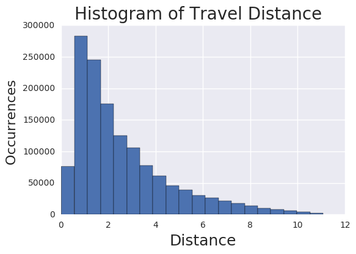


The data shows a very hard skew to the left with the majority of the data points less than 10 miles. If I wanted to model on trip distance I would most likely benefit from a transform it prior to analysis. It definitely makes sense that the majority of trips are shorter trips, but that has created a hard skew.

# Question 3
 - Report mean and median trip distance grouped by hour of day.

 - We'd like to get a rough sense of identifying trips that originate or terminate at one of the NYC area airports. Can you provide a count of how many transactions fit this criteria, the average fair, and any other interesting characteristics of these trips.

## Part 1

 First it was necessary to tell python to read the drop-off and pickup times as dates, this was done in the first two lines of code. From here I created a loop that would calculate interesting data points grouped by hour of day. I probably could have used the groupby() function but this code worked for me so I settled with this.


```python
#this wont work until the variable average speed is created. if you want want to run it before that, remove the hash from the trip area below
# and at one to Speed.append and the other Trip Info Varaible.
SeptData['lpep_pickup_datetime'] = pd.to_datetime(SeptData['lpep_pickup_datetime'], format = '%Y-%m-%d %H:%M:%S')#formatting dates
SeptData['Lpep_dropoff_datetime'] = pd.to_datetime(SeptData['Lpep_dropoff_datetime'], format = '%Y-%m-%d %H:%M:%S')
SeptData1 = SeptData.set_index(SeptData['lpep_pickup_datetime'].dt.hour)
hours = SeptData1['lpep_pickup_datetime'].dt.hour.unique()
means = []
medians = []
Tip = []
Cost = []
Speed = []
#the for loop below creates multiple lists containig useful values, could have tried to shorten this using lambda, but i think this more clear
for i in hours:
    Subset = SeptData1.loc[i]
    means.append(Subset['Trip_distance'].mean())
    medians.append(Subset['Trip_distance'].median())
    Tip.append(Subset['Tip_amount'].mean())
    Cost.append(Subset['Fare_amount'].mean())
    Speed.append(Subset['Average_Speed'].mean())

#TripInfo = pd.DataFrame({'Time of Day': hours,'Mean Distance': means,'Median Distance': medians, 'Mean Fare': Cost, 'Mean Tip':Tip})
TripInfo = pd.DataFrame({'Time of Day': hours,'Mean Distance': means,'Median Distance': medians, 'Mean Fare': Cost, 'Mean Tip':Tip, 'Average Speed': Speed})
```

- So below we have basically what I did right above in two lines of code.


```python
#SeptData5.index = SeptData5['lpep_pickup_datetime']
#Means_Day = SeptData5 .resample('H').mean()
```


```python
TripInfo
```


<div>
<table border="1" class="dataframe">
  <thead>
    <tr style="text-align: right;">
      <th></th>
      <th>Average Speed</th>
      <th>Mean Distance</th>
      <th>Mean Fare</th>
      <th>Mean Tip</th>
      <th>Median Distance</th>
      <th>Time of Day</th>
    </tr>
  </thead>
  <tbody>
    <tr>
      <th>0</th>
      <td>14.551381</td>
      <td>2.979385</td>
      <td>11.873207</td>
      <td>1.185860</td>
      <td>2.200</td>
      <td>0</td>
    </tr>
    <tr>
      <th>1</th>
      <td>14.805915</td>
      <td>2.912099</td>
      <td>11.532851</td>
      <td>1.121383</td>
      <td>2.140</td>
      <td>1</td>
    </tr>
    <tr>
      <th>2</th>
      <td>15.032147</td>
      <td>2.936125</td>
      <td>11.532671</td>
      <td>1.076864</td>
      <td>2.170</td>
      <td>2</td>
    </tr>
    <tr>
      <th>3</th>
      <td>15.343678</td>
      <td>3.026731</td>
      <td>11.738691</td>
      <td>1.013078</td>
      <td>2.210</td>
      <td>3</td>
    </tr>
    <tr>
      <th>4</th>
      <td>15.965009</td>
      <td>3.246530</td>
      <td>12.318851</td>
      <td>0.927399</td>
      <td>2.340</td>
      <td>4</td>
    </tr>
    <tr>
      <th>5</th>
      <td>17.517000</td>
      <td>3.723624</td>
      <td>13.481594</td>
      <td>1.179836</td>
      <td>2.840</td>
      <td>5</td>
    </tr>
    <tr>
      <th>6</th>
      <td>16.645588</td>
      <td>3.650691</td>
      <td>13.512351</td>
      <td>1.377299</td>
      <td>2.800</td>
      <td>6</td>
    </tr>
    <tr>
      <th>7</th>
      <td>13.311972</td>
      <td>3.066363</td>
      <td>12.745385</td>
      <td>1.284122</td>
      <td>2.160</td>
      <td>7</td>
    </tr>
    <tr>
      <th>8</th>
      <td>12.161149</td>
      <td>2.852871</td>
      <td>12.577758</td>
      <td>1.352084</td>
      <td>1.960</td>
      <td>8</td>
    </tr>
    <tr>
      <th>9</th>
      <td>12.452123</td>
      <td>2.834540</td>
      <td>12.408518</td>
      <td>1.333063</td>
      <td>1.970</td>
      <td>9</td>
    </tr>
    <tr>
      <th>10</th>
      <td>12.494802</td>
      <td>2.791001</td>
      <td>12.159538</td>
      <td>1.161746</td>
      <td>1.930</td>
      <td>10</td>
    </tr>
    <tr>
      <th>11</th>
      <td>12.194645</td>
      <td>2.731115</td>
      <td>12.015271</td>
      <td>1.077350</td>
      <td>1.880</td>
      <td>11</td>
    </tr>
    <tr>
      <th>12</th>
      <td>12.089953</td>
      <td>2.717525</td>
      <td>11.948825</td>
      <td>1.050660</td>
      <td>1.895</td>
      <td>12</td>
    </tr>
    <tr>
      <th>13</th>
      <td>11.991026</td>
      <td>2.684440</td>
      <td>11.831550</td>
      <td>1.005803</td>
      <td>1.850</td>
      <td>13</td>
    </tr>
    <tr>
      <th>14</th>
      <td>11.497460</td>
      <td>2.641293</td>
      <td>11.884384</td>
      <td>0.957232</td>
      <td>1.830</td>
      <td>14</td>
    </tr>
    <tr>
      <th>15</th>
      <td>11.141412</td>
      <td>2.620725</td>
      <td>11.951799</td>
      <td>0.971829</td>
      <td>1.800</td>
      <td>15</td>
    </tr>
    <tr>
      <th>16</th>
      <td>10.918532</td>
      <td>2.560685</td>
      <td>11.846962</td>
      <td>1.024360</td>
      <td>1.800</td>
      <td>16</td>
    </tr>
    <tr>
      <th>17</th>
      <td>10.908891</td>
      <td>2.508784</td>
      <td>11.640556</td>
      <td>1.055586</td>
      <td>1.780</td>
      <td>17</td>
    </tr>
    <tr>
      <th>18</th>
      <td>11.492727</td>
      <td>2.518237</td>
      <td>11.352815</td>
      <td>1.096303</td>
      <td>1.800</td>
      <td>18</td>
    </tr>
    <tr>
      <th>19</th>
      <td>12.032342</td>
      <td>2.593936</td>
      <td>11.325131</td>
      <td>1.123594</td>
      <td>1.860</td>
      <td>19</td>
    </tr>
    <tr>
      <th>20</th>
      <td>12.733721</td>
      <td>2.683526</td>
      <td>11.345157</td>
      <td>1.102870</td>
      <td>1.910</td>
      <td>20</td>
    </tr>
    <tr>
      <th>21</th>
      <td>13.555084</td>
      <td>2.867738</td>
      <td>11.682610</td>
      <td>1.182764</td>
      <td>2.030</td>
      <td>21</td>
    </tr>
    <tr>
      <th>22</th>
      <td>14.020976</td>
      <td>3.029568</td>
      <td>12.129948</td>
      <td>1.278653</td>
      <td>2.200</td>
      <td>22</td>
    </tr>
    <tr>
      <th>23</th>
      <td>14.307802</td>
      <td>3.053465</td>
      <td>12.189984</td>
      <td>1.256050</td>
      <td>2.220</td>
      <td>23</td>
    </tr>
  </tbody>
</table>
</div>


### More Data Formatting
 - Looking forward I realized I needed to create a variable that could be used for predictive modeling, so I subtracted the drop-off date and time from the pickup date to create a new variable called ‘Trip Duration’. I them striped the time formatting using timedelta, this is all shown in the code below. The ‘Trip Duration’ variable allows with translate during predictive modeling much better than the previous data/time format by creating a floating point number for the length of each trip. The ‘Trip Duration’ ultimately allows for a deeper understanding of the September data in general.


```python
SeptData['Trip_duration'] = SeptData['Lpep_dropoff_datetime'] - SeptData['lpep_pickup_datetime']  
```


```python
SeptData['Trip_duration'] = pd.to_timedelta(SeptData['Trip_duration'])
```


```python
SeptData['Trip_duration'] = SeptData['Trip_duration'].dt.total_seconds()
```


```python
SeptData = SeptData.loc[SeptData['Trip_duration'] > 0]
# you'd be suprised 
```

### Results 

- Here are the results are shown below in a dataframe. I also thought it might be more useful to plot it out in order to be visualize the output, that is also show below. Speeds are faster during the night becasue less people are on the road.


```python
TripInfo
```


<div>
<table border="1" class="dataframe">
  <thead>
    <tr style="text-align: right;">
      <th></th>
      <th>Mean Distance</th>
      <th>Mean Fare</th>
      <th>Mean Tip</th>
      <th>Median Distance</th>
      <th>Time of Day</th>
    </tr>
  </thead>
  <tbody>
    <tr>
      <th>0</th>
      <td>2.982456</td>
      <td>11.884893</td>
      <td>1.185284</td>
      <td>2.20</td>
      <td>0</td>
    </tr>
    <tr>
      <th>1</th>
      <td>2.913982</td>
      <td>11.540083</td>
      <td>1.120047</td>
      <td>2.14</td>
      <td>1</td>
    </tr>
    <tr>
      <th>2</th>
      <td>2.938782</td>
      <td>11.542717</td>
      <td>1.077774</td>
      <td>2.17</td>
      <td>2</td>
    </tr>
    <tr>
      <th>3</th>
      <td>3.031364</td>
      <td>11.756729</td>
      <td>1.013580</td>
      <td>2.21</td>
      <td>3</td>
    </tr>
    <tr>
      <th>4</th>
      <td>3.257946</td>
      <td>12.349196</td>
      <td>0.930319</td>
      <td>2.35</td>
      <td>4</td>
    </tr>
    <tr>
      <th>5</th>
      <td>3.728549</td>
      <td>13.509643</td>
      <td>1.181936</td>
      <td>2.84</td>
      <td>5</td>
    </tr>
    <tr>
      <th>6</th>
      <td>3.651838</td>
      <td>13.531570</td>
      <td>1.378521</td>
      <td>2.80</td>
      <td>6</td>
    </tr>
    <tr>
      <th>7</th>
      <td>3.065905</td>
      <td>12.756276</td>
      <td>1.282958</td>
      <td>2.16</td>
      <td>7</td>
    </tr>
    <tr>
      <th>8</th>
      <td>2.851920</td>
      <td>12.584908</td>
      <td>1.351626</td>
      <td>1.96</td>
      <td>8</td>
    </tr>
    <tr>
      <th>9</th>
      <td>2.833852</td>
      <td>12.415821</td>
      <td>1.332082</td>
      <td>1.96</td>
      <td>9</td>
    </tr>
    <tr>
      <th>10</th>
      <td>2.790593</td>
      <td>12.162984</td>
      <td>1.161085</td>
      <td>1.93</td>
      <td>10</td>
    </tr>
    <tr>
      <th>11</th>
      <td>2.730687</td>
      <td>12.023545</td>
      <td>1.076679</td>
      <td>1.88</td>
      <td>11</td>
    </tr>
    <tr>
      <th>12</th>
      <td>2.717697</td>
      <td>11.954309</td>
      <td>1.050641</td>
      <td>1.89</td>
      <td>12</td>
    </tr>
    <tr>
      <th>13</th>
      <td>2.683700</td>
      <td>11.836670</td>
      <td>1.005978</td>
      <td>1.85</td>
      <td>13</td>
    </tr>
    <tr>
      <th>14</th>
      <td>2.640668</td>
      <td>11.886238</td>
      <td>0.956842</td>
      <td>1.83</td>
      <td>14</td>
    </tr>
    <tr>
      <th>15</th>
      <td>2.620080</td>
      <td>11.955963</td>
      <td>0.971970</td>
      <td>1.80</td>
      <td>15</td>
    </tr>
    <tr>
      <th>16</th>
      <td>2.561128</td>
      <td>11.850420</td>
      <td>1.024120</td>
      <td>1.80</td>
      <td>16</td>
    </tr>
    <tr>
      <th>17</th>
      <td>2.508997</td>
      <td>11.641993</td>
      <td>1.055329</td>
      <td>1.78</td>
      <td>17</td>
    </tr>
    <tr>
      <th>18</th>
      <td>2.518126</td>
      <td>11.355018</td>
      <td>1.096113</td>
      <td>1.80</td>
      <td>18</td>
    </tr>
    <tr>
      <th>19</th>
      <td>2.594227</td>
      <td>11.326222</td>
      <td>1.123191</td>
      <td>1.86</td>
      <td>19</td>
    </tr>
    <tr>
      <th>20</th>
      <td>2.683264</td>
      <td>11.347054</td>
      <td>1.102778</td>
      <td>1.91</td>
      <td>20</td>
    </tr>
    <tr>
      <th>21</th>
      <td>2.868113</td>
      <td>11.686134</td>
      <td>1.182449</td>
      <td>2.03</td>
      <td>21</td>
    </tr>
    <tr>
      <th>22</th>
      <td>3.029485</td>
      <td>12.130907</td>
      <td>1.277973</td>
      <td>2.20</td>
      <td>22</td>
    </tr>
    <tr>
      <th>23</th>
      <td>3.054007</td>
      <td>12.193715</td>
      <td>1.255458</td>
      <td>2.22</td>
      <td>23</td>
    </tr>
  </tbody>
</table>
</div>


```python
TripInfo.plot(x = 'Time of Day'); plt.legend(loc='best')
```


    <matplotlib.legend.Legend at 0x29217f63d30>


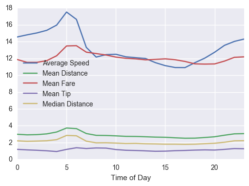


### Analysis 
 - Some interesting observations here are that there is a noticeable spike in the cost of the trip to the airport at 5 am, this is explained by the spike in distance also observed around 5am. If the trips get longer than the  cost will go up. I also think that are lot of people are trying to get to work at that time. I also attribute the increase of speed to lot of new cab drivers beginning their day. There is also a slight bump in fairs around 12am.

## Part 2

For part two of this question I decided to focus on JFK airport. So initially I used rate code 'JFK' but then after further reading I realized it only included Manhattan to JFK trips not all trips to JFKF. Then I thought I could probably use a package like folium and maybe gmplot to classify drop-offs and pickups at JFK and to create a nice visualization. I ultimately didn’t get the code running. I think part of it was the processing power of my computer is lacking. I ended up doing is creating a coordinate grid based on the longitude and latitude of JFK airport. The code is shown below. 


```python
# if i had just used the rate code 2, this would have been my code
SeptData.loc[SeptData['RateCodeID'] == 2]['Fare_amount'].mean()
SeptData.loc[SeptData['RateCodeID'] == 2]['Total_amount'].median()

```


```python
#here the code for creating a grid.
Airport_Dropoff=SeptData.loc[(SeptData['Dropoff_latitude'] < 40.66) & (SeptData['Dropoff_latitude'] > 40.63 )
             & (SeptData['Dropoff_longitude'] > -73.81) & (SeptData['Dropoff_longitude'] < -73.76)]
Airport_Pickup =SeptData.loc[(SeptData['Pickup_latitude'] < 40.66) & (SeptData['Pickup_latitude'] > 40.63 )
             & (SeptData['Pickup_longitude'] > -73.81) & (SeptData['Pickup_longitude'] < -73.76)]
# i create a subset of data that qualifies for dropoff and pickup
```

Using the shape[0] method I able to gather an accurate count of how many people are picked up and dropped off at the airport for the month of september. 

```python
Airport_Dropoff.shape[0]
#9318 people dropped off
Airport_Pickup.shape[0]
#135 people picked up
```


Checking the Average fare for both pickups and dropoffs, the average fare is lower for dropoffs. This also 
```python
Airport_Pickup['Fare_amount'].mean()
#23.633703703703706
Airport_Dropoff['Fare_amount'].mean()
#36.63378407383559
```


### Analysis
- There are signifcantly more people dropped off using green taxis, which makes sense because green taxis are not allowed to pick up via street hails at airports, so these results are expected.Checking the Average fare for both pickups and dropoffs, the average fare is lower for dropoffs. This also  makes sense because trips from Manhattan to JFK are automatically rate 2, which is 52.00, this greatly increases the dropoff statistics measurements. 


```python
Airport_Dropoff[['Passenger_count','Trip_distance','Fare_amount','Extra']].hist()
```


    array([[<matplotlib.axes._subplots.AxesSubplot object at 0x00000161D1F7D8D0>,
            <matplotlib.axes._subplots.AxesSubplot object at 0x00000161D21D8748>],
           [<matplotlib.axes._subplots.AxesSubplot object at 0x00000161D2225128>,
            <matplotlib.axes._subplots.AxesSubplot object at 0x00000161D2262470>]], dtype=object)


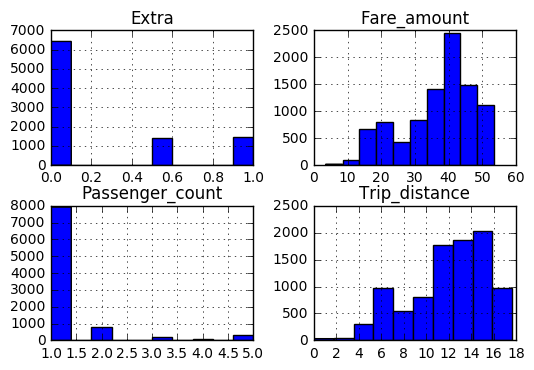


```python
Airport_Pickup[['Passenger_count','Trip_distance','Fare_amount','Extra']].hist()
```


    array([[<matplotlib.axes._subplots.AxesSubplot object at 0x00000161D256B400>,
            <matplotlib.axes._subplots.AxesSubplot object at 0x00000161D263E780>],
           [<matplotlib.axes._subplots.AxesSubplot object at 0x00000161D268D198>,
            <matplotlib.axes._subplots.AxesSubplot object at 0x00000161D26C83C8>]], dtype=object)


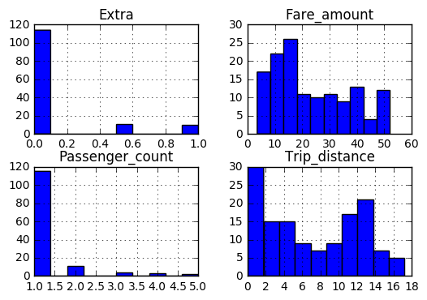


```python
Airport_Dropoff[['Tip_amount', 'Tolls_amount','Total_amount','Payment_type']].hist()
```


    array([[<matplotlib.axes._subplots.AxesSubplot object at 0x00000161D23C23C8>,
            <matplotlib.axes._subplots.AxesSubplot object at 0x00000161D2433EB8>],
           [<matplotlib.axes._subplots.AxesSubplot object at 0x00000161D24828D0>,
            <matplotlib.axes._subplots.AxesSubplot object at 0x00000161D24BD9E8>]], dtype=object)


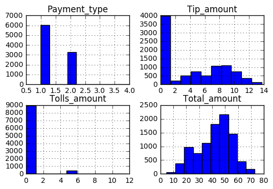


```python
Airport_Pickup[['Tip_amount', 'Tolls_amount','Total_amount','Payment_type']].hist()
```


    array([[<matplotlib.axes._subplots.AxesSubplot object at 0x00000161D2C31780>,
            <matplotlib.axes._subplots.AxesSubplot object at 0x00000161D2CDC438>],
           [<matplotlib.axes._subplots.AxesSubplot object at 0x00000161D2D24E10>,
            <matplotlib.axes._subplots.AxesSubplot object at 0x00000161D2D64080>]], dtype=object)


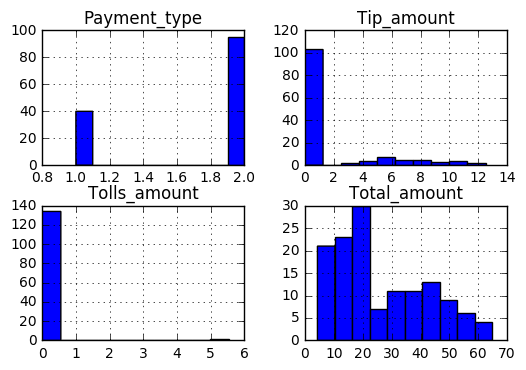


### Analysis
- Some quick things I noticed from the histograms. The distributions for extra charges seem to be about the same, as do passenger count, tip amount, and toll amount. Total amount varies a lot, which is explained by the difference in fare amount. There seem to be a disproportionate number of short trips leaving the airport, which might be worth spending more time looking at. The payment types also vary significantly, but I think that can again be explained by the fact that green taxis can’t be hailed at JFK and therefore must be booked in advance. 

# Question 4

 - Build a derived variable for tip as a percentage of the total fare.

 - Build a predictive model for tip as a percentage of the total fare. Use as much of the data as you like (or all of it). We will validate a sample.

## Part 1


Building a derived variable for tip as a percentage of total fair is pretty straightforward. By taking tip amount and dividing it by total amount and then multiplying by 100, the variable Tip Percentage was created.


```python
SeptData['Tip_Percentage'] = SeptData['Tip_amount']/SeptData['Total_amount']*100
```


```python
SeptData['Tip_Percentage'].describe()
```


    count    1.414855e+06
    mean     6.575787e+00
    std      8.476309e+00
    min      0.000000e+00
    25%      0.000000e+00
    50%      0.000000e+00
    75%      1.666667e+01
    max      7.246377e+01
    Name: Tip_Percentage, dtype: float64


### More Cleaning!

 - So before proceeding with data modeling its necessary to shape the data a bit more. The categorical variables need to be dealt with and the distributions of some of the continuous varaibles are non-normal. The categorical variables were converted to multiple binaries and non-normal variables will be transformed. 


```python
SeptData2 = SeptData
```


```python
for j in SeptData2.RateCodeID.unique():
    SeptData2['RateCode'+ str(j)] = SeptData2['RateCodeID'] == j 
    SeptData2['RateCode'+ str(j)] = SeptData2['RateCode'+ str(j)].astype(int)
del SeptData2['RateCodeID']
#realized later i coud have just used the get_dummies function
```


```python
for j in SeptData2['Trip_type '].unique():
    SeptData2['Trip_type '+ str(j)] = SeptData2['Trip_type '] == j 
    SeptData2['Trip_type '+ str(j)] = SeptData2['Trip_type '+ str(j)].astype(int)
del SeptData2['Trip_type ']
```


```python
for j in SeptData2.Payment_type.unique():
    SeptData2['Payment_type'+ str(j)] = SeptData2['Payment_type'] == j 
    SeptData2['Payment_type'+ str(j)] = SeptData2['Payment_type'+ str(j)].astype(int)
del SeptData2['Payment_type']
```


```python
Store_bin = pd.get_dummies(SeptData2['Store_and_fwd_flag'])
SeptData2 = pd.concat([SeptData2, Store_bin], axis = 1)
del SeptData2['Store_and_fwd_flag']
```


```python
sns.set(style = 'whitegrid', context = 'notebook')
col = ['Passenger_count','Trip_distance','Fare_amount','Extra','MTA_tax','Tip_amount', 'Tolls_amount','improvement_surcharge' ,'Total_amount']
sns.pairplot(SeptData2[col], size = 2.5)
plt.show()
```


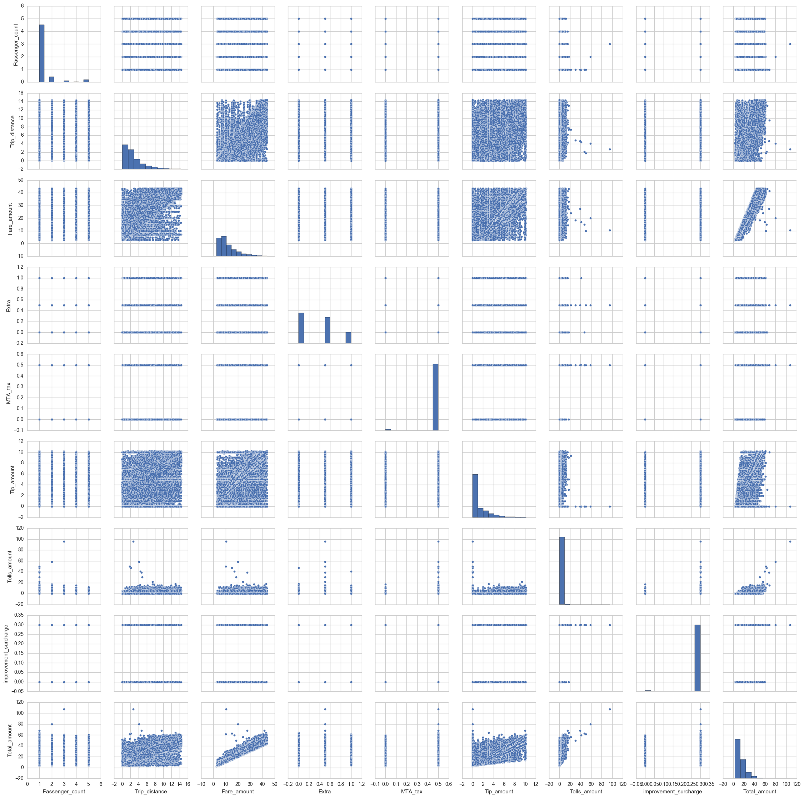


## Part 2

To be honest I am a bit confused by this problem, I just built the variable Tip percentage and now the question is asking to build a model for the predication of this variable. Realistically we don’t need a predictive model to do this if we know both the Tip amount and the Fair Total because of the equation I derived in part one. This is supported by looking at the correlation plot below, which shows there is strong correlation between Tip percentage, Tip amount, Payment Type, and Total Amount.


```python
sns.heatmap(SeptData2.corr())
```


    <matplotlib.axes._subplots.AxesSubplot at 0x292091445c0>


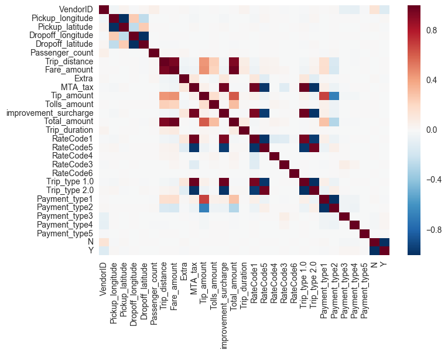


```python
SeptData2['Trip_distance'] = SeptData2['Trip_distance'].apply(np.log) 
SeptData2['Fare_amount'] = SeptData2['Fare_amount'].apply(np.log) 
SeptData2['Tip_amount'] = (SeptData2['Tip_amount']+1).apply(np.log) 
SeptData2['Total_amount'] = SeptData2['Total_amount'].apply(np.log) 
del SeptData2['lpep_pickup_datetime']
del SeptData2['Lpep_dropoff_datetime']
```


```python
sns.set(style = 'whitegrid', context = 'notebook')
col = ['Trip_distance','Fare_amount','Tip_amount','Total_amount']
sns.pairplot(SeptData2[col],size = 2.5)
plt.show()
```


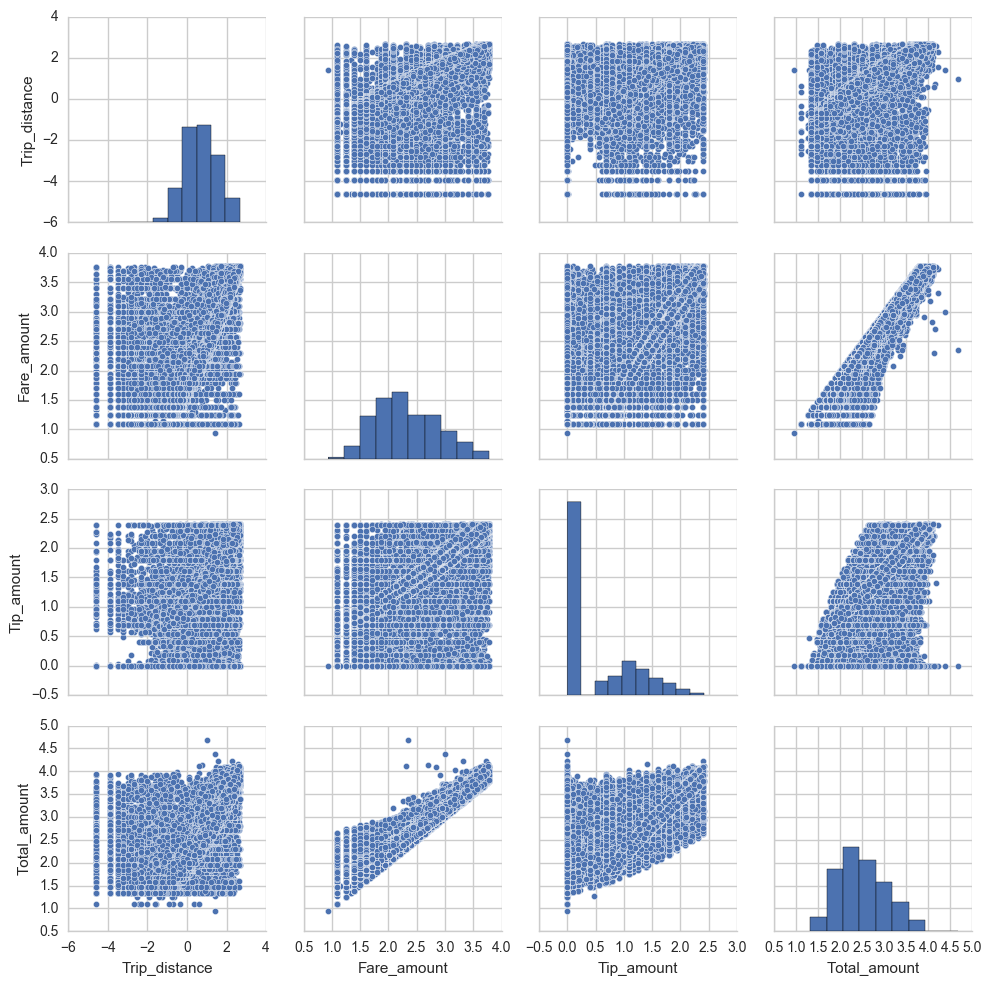


### Analysis

- I ended up transforming four variables:'Trip_distance','Fare_amount','Tip_amount','Total_amount'.All four variables were exhibiting non-normal distribution. Looking at the histograms of the transformed data, they appear to be much closer to a normal distribution now. when doing the log transformations it was necessary to scale all of the Tip amounts by 1, because log(0) is undefined but log(1) is 0 so the data still reflects that there is a significant number of people that haven’t tipped which is exactly what we want.

### Building A Predictive Model

- So, for this portion of the question I decided to use the entire dataset as the training dataset, normally I would divide the dataset 70/30(or 80/20 depending on data size) but in this case since your team plans to test it, I figured why not used the entire dataset to create the model. Looking at the R-squared/Adj-R-squared, that model preformed fairly well. If I had more time I would have definably looked into PCA-R or PLRS, OLS is a great place to start but there are definitely stronger models out there. I also would have also greatly reduced the number of variables involved, it’s pretty clear looking at the results and the correlation plot that most of the variables add nothing to the regression equation. 


```python
Y = SeptData2['Tip_Percentage']
```


```python
X = SeptData2.columns[:-1].values.tolist()
```


```python
Sept_X = SeptData2[['VendorID','Pickup_longitude','Pickup_latitude', 'Dropoff_longitude', 'Dropoff_latitude', 
                    'Passenger_count', 'Trip_distance', 'Fare_amount', 'Extra', 'MTA_tax', 'Tip_amount', 'Tolls_amount'
                    ,'improvement_surcharge','Total_amount', 'Trip_duration', 'RateCode1', 'RateCode5' ,'RateCode4', 'RateCode3',
                    'RateCode6', 'Trip_type 1.0', 'Trip_type 2.0', 'Payment_type1', 'Payment_type2', 'Payment_type3',
                    'Payment_type4', 'Payment_type5', 'N', 'Y']]
```


```python
model = sm.OLS(Y, Sept_X)
results = model.fit()
```


```python
results.summary()
```


<table class="simpletable">
<caption>OLS Regression Results</caption>
<tr>
  <th>Dep. Variable:</th>     <td>Tip_Percentage</td>  <th>  R-squared:         </th>  <td>   0.960</td>  
</tr>
<tr>
  <th>Model:</th>                   <td>OLS</td>       <th>  Adj. R-squared:    </th>  <td>   0.960</td>  
</tr>
<tr>
  <th>Method:</th>             <td>Least Squares</td>  <th>  F-statistic:       </th>  <td>1.348e+06</td> 
</tr>
<tr>
  <th>Date:</th>             <td>Tue, 17 Jan 2017</td> <th>  Prob (F-statistic):</th>   <td>  0.00</td>   
</tr>
<tr>
  <th>Time:</th>                 <td>14:13:17</td>     <th>  Log-Likelihood:    </th> <td>-2.7594e+06</td>
</tr>
<tr>
  <th>No. Observations:</th>      <td>1414855</td>     <th>  AIC:               </th>  <td>5.519e+06</td> 
</tr>
<tr>
  <th>Df Residuals:</th>          <td>1414829</td>     <th>  BIC:               </th>  <td>5.519e+06</td> 
</tr>
<tr>
  <th>Df Model:</th>              <td>    25</td>      <th>                     </th>      <td> </td>     
</tr>
<tr>
  <th>Covariance Type:</th>      <td>nonrobust</td>    <th>                     </th>      <td> </td>     
</tr>
</table>
<table class="simpletable">
<tr>
            <td></td>               <th>coef</th>     <th>std err</th>      <th>t</th>      <th>P>|t|</th> <th>[95.0% Conf. Int.]</th> 
</tr>
<tr>
  <th>VendorID</th>              <td>    0.0071</td> <td>    0.004</td> <td>    2.010</td> <td> 0.044</td> <td>    0.000     0.014</td>
</tr>
<tr>
  <th>Pickup_longitude</th>      <td>   -0.2251</td> <td>    0.023</td> <td>   -9.957</td> <td> 0.000</td> <td>   -0.269    -0.181</td>
</tr>
<tr>
  <th>Pickup_latitude</th>       <td>   -0.4150</td> <td>    0.041</td> <td>  -10.121</td> <td> 0.000</td> <td>   -0.495    -0.335</td>
</tr>
<tr>
  <th>Dropoff_longitude</th>     <td>   -0.3434</td> <td>    0.023</td> <td>  -15.259</td> <td> 0.000</td> <td>   -0.387    -0.299</td>
</tr>
<tr>
  <th>Dropoff_latitude</th>      <td>   -0.6219</td> <td>    0.041</td> <td>  -15.236</td> <td> 0.000</td> <td>   -0.702    -0.542</td>
</tr>
<tr>
  <th>Passenger_count</th>       <td>    0.0086</td> <td>    0.002</td> <td>    5.284</td> <td> 0.000</td> <td>    0.005     0.012</td>
</tr>
<tr>
  <th>Trip_distance</th>         <td>    0.9692</td> <td>    0.005</td> <td>  194.649</td> <td> 0.000</td> <td>    0.959     0.979</td>
</tr>
<tr>
  <th>Fare_amount</th>           <td>  -47.1230</td> <td>    0.034</td> <td>-1368.517</td> <td> 0.000</td> <td>  -47.191   -47.056</td>
</tr>
<tr>
  <th>Extra</th>                 <td>   -4.9208</td> <td>    0.005</td> <td> -905.506</td> <td> 0.000</td> <td>   -4.931    -4.910</td>
</tr>
<tr>
  <th>MTA_tax</th>               <td>   -4.1774</td> <td>    0.244</td> <td>  -17.090</td> <td> 0.000</td> <td>   -4.657    -3.698</td>
</tr>
<tr>
  <th>Tip_amount</th>            <td>    4.6552</td> <td>    0.006</td> <td>  729.782</td> <td> 0.000</td> <td>    4.643     4.668</td>
</tr>
<tr>
  <th>Tolls_amount</th>          <td>   -2.1922</td> <td>    0.002</td> <td> -891.095</td> <td> 0.000</td> <td>   -2.197    -2.187</td>
</tr>
<tr>
  <th>improvement_surcharge</th> <td>   -5.4247</td> <td>    0.202</td> <td>  -26.792</td> <td> 0.000</td> <td>   -5.822    -5.028</td>
</tr>
<tr>
  <th>Total_amount</th>          <td>   49.6250</td> <td>    0.039</td> <td> 1282.965</td> <td> 0.000</td> <td>   49.549    49.701</td>
</tr>
<tr>
  <th>Trip_duration</th>         <td>-4.654e-06</td> <td> 2.48e-07</td> <td>  -18.802</td> <td> 0.000</td> <td>-5.14e-06 -4.17e-06</td>
</tr>
<tr>
  <th>RateCode1</th>             <td>   -1.1354</td> <td>    0.128</td> <td>   -8.864</td> <td> 0.000</td> <td>   -1.386    -0.884</td>
</tr>
<tr>
  <th>RateCode5</th>             <td>   -1.2192</td> <td>    0.129</td> <td>   -9.464</td> <td> 0.000</td> <td>   -1.472    -0.967</td>
</tr>
<tr>
  <th>RateCode4</th>             <td>   -1.5429</td> <td>    0.147</td> <td>  -10.504</td> <td> 0.000</td> <td>   -1.831    -1.255</td>
</tr>
<tr>
  <th>RateCode3</th>             <td>    1.2965</td> <td>    0.170</td> <td>    7.605</td> <td> 0.000</td> <td>    0.962     1.631</td>
</tr>
<tr>
  <th>RateCode6</th>             <td>   -2.0970</td> <td>    0.577</td> <td>   -3.632</td> <td> 0.000</td> <td>   -3.229    -0.965</td>
</tr>
<tr>
  <th>Trip_type 1.0</th>         <td>   -2.3427</td> <td>    0.096</td> <td>  -24.401</td> <td> 0.000</td> <td>   -2.531    -2.155</td>
</tr>
<tr>
  <th>Trip_type 2.0</th>         <td>   -2.3552</td> <td>    0.077</td> <td>  -30.508</td> <td> 0.000</td> <td>   -2.507    -2.204</td>
</tr>
<tr>
  <th>Payment_type1</th>         <td>    0.4200</td> <td>    0.049</td> <td>    8.493</td> <td> 0.000</td> <td>    0.323     0.517</td>
</tr>
<tr>
  <th>Payment_type2</th>         <td>   -1.1493</td> <td>    0.049</td> <td>  -23.307</td> <td> 0.000</td> <td>   -1.246    -1.053</td>
</tr>
<tr>
  <th>Payment_type3</th>         <td>   -1.7894</td> <td>    0.056</td> <td>  -31.931</td> <td> 0.000</td> <td>   -1.899    -1.680</td>
</tr>
<tr>
  <th>Payment_type4</th>         <td>   -1.2014</td> <td>    0.055</td> <td>  -21.719</td> <td> 0.000</td> <td>   -1.310    -1.093</td>
</tr>
<tr>
  <th>Payment_type5</th>         <td>   -0.9779</td> <td>    0.205</td> <td>   -4.769</td> <td> 0.000</td> <td>   -1.380    -0.576</td>
</tr>
<tr>
  <th>N</th>                     <td>   -2.3398</td> <td>    0.063</td> <td>  -36.928</td> <td> 0.000</td> <td>   -2.464    -2.216</td>
</tr>
<tr>
  <th>Y</th>                     <td>   -2.3581</td> <td>    0.064</td> <td>  -36.678</td> <td> 0.000</td> <td>   -2.484    -2.232</td>
</tr>
</table>
<table class="simpletable">
<tr>
  <th>Omnibus:</th>       <td>431573.628</td> <th>  Durbin-Watson:     </th>   <td>   1.906</td>  
</tr>
<tr>
  <th>Prob(Omnibus):</th>   <td> 0.000</td>   <th>  Jarque-Bera (JB):  </th> <td>12619431.510</td>
</tr>
<tr>
  <th>Skew:</th>            <td>-0.864</td>   <th>  Prob(JB):          </th>   <td>    0.00</td>  
</tr>
<tr>
  <th>Kurtosis:</th>        <td>17.528</td>   <th>  Cond. No.          </th>   <td>1.03e+16</td>  
</tr>
</table>


### Analysis

 - The model fits pretty well, the R^2 is nice and high, but the AIC and BIC are also large because the excessive number of variables in regression equation. But, the model does work well and is able to accurately fit 96% of the variables to the regression line.

# Question 5

- Build a derived variable representing the average speed over the course of a trip.

- Can you perform a test to determine if the average trip speeds are materially the same in all weeks of September? If you decide they are not the same, can you form a hypothesis regarding why they differ?

- Can you build up a hypothesis of average trip speed as a function of time of day?

   ## Part 1

So, the first thing I did here was create a variable called 'Average_Speed'(miles) variable by diving 'Trip_distance' by 'Trip_duration', which in case you forgot, is the trip duration in seconds. I divide the 'Trip_duration' variable by 60, to get the trip duration in minutes and then multiple again by 60 to get miles per hour. I again implemented the same formula I used earlier to trim the newly created Average_Speed variable. I think prior to this it was saying somebodies average speed was 18000mph, I’ve heard they drive fast in NY but this just seems excessive. 


```python
SeptData['Average_Speed'] = SeptData['Trip_distance']/(SeptData['Trip_duration']/60)
```


```python
SeptData['Average_Speed'] = SeptData['Average_Speed']*60
#now its in miles/hour
```


```python
Mean = SeptData['Average_Speed'].mean()
std1 = MeanTip = SeptData['Average_Speed'].std()*3
Max1 = Mean + std
Min1 = Mean - std
#print(Max)
SeptData = SeptData.loc[(SeptData['Average_Speed'] < Max1) & (SeptData['Average_Speed'] > Min1) ]
```


```python
SeptData.head()
```


<div>
<table border="1" class="dataframe">
  <thead>
    <tr style="text-align: right;">
      <th></th>
      <th>VendorID</th>
      <th>lpep_pickup_datetime</th>
      <th>Lpep_dropoff_datetime</th>
      <th>Store_and_fwd_flag</th>
      <th>Pickup_longitude</th>
      <th>Pickup_latitude</th>
      <th>Dropoff_longitude</th>
      <th>Dropoff_latitude</th>
      <th>Passenger_count</th>
      <th>Trip_distance</th>
      <th>...</th>
      <th>RateCode3</th>
      <th>RateCode6</th>
      <th>Trip_type 1.0</th>
      <th>Trip_type 2.0</th>
      <th>Payment_type1</th>
      <th>Payment_type2</th>
      <th>Payment_type3</th>
      <th>Payment_type4</th>
      <th>Payment_type5</th>
      <th>Average_Speed</th>
    </tr>
  </thead>
  <tbody>
    <tr>
      <th>2</th>
      <td>2</td>
      <td>2015-09-01 00:01:50</td>
      <td>2015-09-01 00:04:24</td>
      <td>N</td>
      <td>-73.921410</td>
      <td>40.766708</td>
      <td>-73.914413</td>
      <td>40.764687</td>
      <td>1</td>
      <td>0.59</td>
      <td>...</td>
      <td>0</td>
      <td>0</td>
      <td>1</td>
      <td>0</td>
      <td>1</td>
      <td>0</td>
      <td>0</td>
      <td>0</td>
      <td>0</td>
      <td>13.792208</td>
    </tr>
    <tr>
      <th>3</th>
      <td>2</td>
      <td>2015-09-01 00:02:36</td>
      <td>2015-09-01 00:06:42</td>
      <td>N</td>
      <td>-73.921387</td>
      <td>40.766678</td>
      <td>-73.931427</td>
      <td>40.771584</td>
      <td>1</td>
      <td>0.74</td>
      <td>...</td>
      <td>0</td>
      <td>0</td>
      <td>1</td>
      <td>0</td>
      <td>0</td>
      <td>1</td>
      <td>0</td>
      <td>0</td>
      <td>0</td>
      <td>10.829268</td>
    </tr>
    <tr>
      <th>4</th>
      <td>2</td>
      <td>2015-09-01 00:00:14</td>
      <td>2015-09-01 00:04:20</td>
      <td>N</td>
      <td>-73.955482</td>
      <td>40.714046</td>
      <td>-73.944412</td>
      <td>40.714729</td>
      <td>1</td>
      <td>0.61</td>
      <td>...</td>
      <td>0</td>
      <td>0</td>
      <td>1</td>
      <td>0</td>
      <td>0</td>
      <td>1</td>
      <td>0</td>
      <td>0</td>
      <td>0</td>
      <td>8.926829</td>
    </tr>
    <tr>
      <th>5</th>
      <td>2</td>
      <td>2015-09-01 00:00:39</td>
      <td>2015-09-01 00:05:20</td>
      <td>N</td>
      <td>-73.945297</td>
      <td>40.808186</td>
      <td>-73.937668</td>
      <td>40.821198</td>
      <td>1</td>
      <td>1.07</td>
      <td>...</td>
      <td>0</td>
      <td>0</td>
      <td>1</td>
      <td>0</td>
      <td>1</td>
      <td>0</td>
      <td>0</td>
      <td>0</td>
      <td>0</td>
      <td>13.708185</td>
    </tr>
    <tr>
      <th>6</th>
      <td>2</td>
      <td>2015-09-01 00:00:52</td>
      <td>2015-09-01 00:05:50</td>
      <td>N</td>
      <td>-73.890877</td>
      <td>40.746426</td>
      <td>-73.876923</td>
      <td>40.756306</td>
      <td>1</td>
      <td>1.43</td>
      <td>...</td>
      <td>0</td>
      <td>0</td>
      <td>1</td>
      <td>0</td>
      <td>1</td>
      <td>0</td>
      <td>0</td>
      <td>0</td>
      <td>0</td>
      <td>17.275168</td>
    </tr>
  </tbody>
</table>
<p>5 rows × 31 columns</p>
</div>


## Part 2

So for part two I used a similar code chunk as the one I used earlier but just specified difference constraints. I Separated the dataset by day instead of hour, and then grabbed metrics and complied them into the dataframe shown below.


```python
SeptData3 = SeptData.set_index(SeptData['lpep_pickup_datetime'].dt.day)
Day = SeptData3['lpep_pickup_datetime'].dt.day.unique()
meansDay = []
TipDay = []
CostDay = []
SpeedDay = []
for i in Day:
    SubsetDay = SeptData3.loc[i]
    meansDay.append(SubsetDay['Trip_distance'].mean())
    TipDay.append(SubsetDay['Tip_amount'].mean())
    CostDay.append(SubsetDay['Fare_amount'].mean())
    SpeedDay.append(SubsetDay['Average_Speed'].mean())
TripDay = pd.DataFrame({'Day of the Month': Day,'Mean Distance': meansDay, 'Mean Fare': CostDay, 'Mean Tip':TipDay, 'Mean Speed':SpeedDay})

#TripDay = pd.DataFrame({ 'Count':Count})
```

 - Below is a plot that represents Mean Distance/Fare/Speed/Tip for each day of September 2016, its interesting and if I had more time I would like to do some time series modeling on mean speed and maybe mean fare as there does appear to be some cyclical trends. I image speeds pick up on days people drive less(weekends)


```python
TripDay.plot(x = 'Day of the Month'); plt.legend(loc='best')
```


    <matplotlib.legend.Legend at 0x2920928abe0>


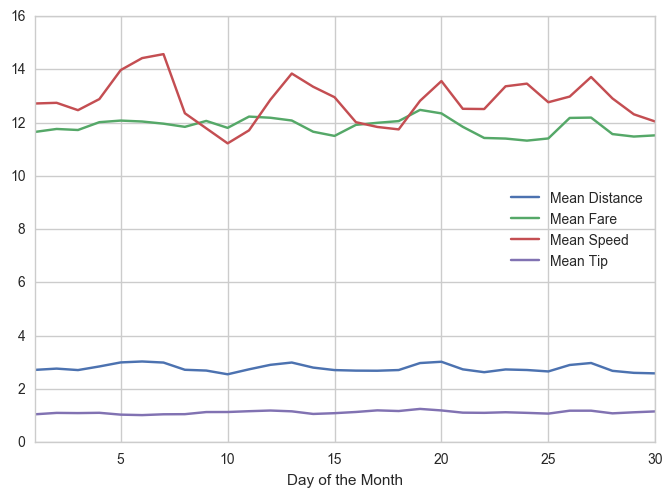


### Initial Solution
 - So I made a variable called TripDay with the averages of difference observations for that day. Initially I just split up the days by the each week of the 2016 calendar and took the averages of each variable(Mean distance, Mean fare, etc..). For there I plotted the Mean Trip Speed. The results are shown below.


```python
Week1 = TripDay[:4].mean()
Week2 = TripDay[4:11].mean()
Week3 = TripDay[11:18].mean()
Week4 = TripDay[18:25].mean()
Week5 = TripDay[25:].mean()
```


```python
Week_ave = pd.concat([Week1, Week2, Week3, Week4, Week5], axis = 1)
```


```python
Week_ave = Week_ave.transpose()
```


```python
Week_ave['Mean Speed'].plot(x = Week_ave.index); plt.legend(loc='best')
```


    <matplotlib.legend.Legend at 0x2920924af60>


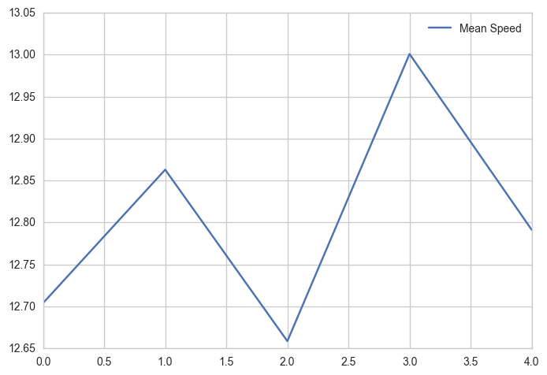


### Initial Solution 2.0

- I soon realized that this wasn’t a true mean because it didn’t take into consideration the number of observations per day. So I took a count of the number of rides per day and added that to the Tripday variable, creating a new variables called Results. Then using the true formula for adding means I was eventually able to plot the results shown below.


```python
Counts = SeptData3.index.value_counts() # counting the number of occurances for each day
Counts = pd.DataFrame(Counts)  #making it a DF
Results = pd.concat([TripDay, Counts], axis = 1) #Adding to TripDay
Results['lpep_pickup_datetime'] = Results['lpep_pickup_datetime'].shift(-1) #formatting
```

 - Below I created a new variable for the average speed per day times the number of occurrences.


```python
Results['Mean-Count'] = Results['Mean Speed'] * Results['lpep_pickup_datetime'] 
```


```python
Results
```


<div>
<table border="1" class="dataframe">
  <thead>
    <tr style="text-align: right;">
      <th></th>
      <th>Day of the Month</th>
      <th>Mean Distance</th>
      <th>Mean Fare</th>
      <th>Mean Speed</th>
      <th>Mean Tip</th>
      <th>lpep_pickup_datetime</th>
      <th>Mean-Count</th>
    </tr>
  </thead>
  <tbody>
    <tr>
      <th>0</th>
      <td>1.0</td>
      <td>2.720136</td>
      <td>11.652779</td>
      <td>12.718859</td>
      <td>1.053113</td>
      <td>39143.0</td>
      <td>497854.313525</td>
    </tr>
    <tr>
      <th>1</th>
      <td>2.0</td>
      <td>2.767251</td>
      <td>11.762875</td>
      <td>12.744383</td>
      <td>1.105034</td>
      <td>40930.0</td>
      <td>521627.593090</td>
    </tr>
    <tr>
      <th>2</th>
      <td>3.0</td>
      <td>2.712372</td>
      <td>11.723996</td>
      <td>12.468175</td>
      <td>1.097684</td>
      <td>45536.0</td>
      <td>567750.831324</td>
    </tr>
    <tr>
      <th>3</th>
      <td>4.0</td>
      <td>2.848257</td>
      <td>12.017409</td>
      <td>12.884587</td>
      <td>1.108395</td>
      <td>51153.0</td>
      <td>659085.278763</td>
    </tr>
    <tr>
      <th>4</th>
      <td>5.0</td>
      <td>2.999831</td>
      <td>12.077520</td>
      <td>13.973402</td>
      <td>1.039547</td>
      <td>55683.0</td>
      <td>778080.967430</td>
    </tr>
    <tr>
      <th>5</th>
      <td>6.0</td>
      <td>3.034956</td>
      <td>12.042606</td>
      <td>14.422654</td>
      <td>1.022103</td>
      <td>50378.0</td>
      <td>726584.488003</td>
    </tr>
    <tr>
      <th>6</th>
      <td>7.0</td>
      <td>2.994353</td>
      <td>11.961259</td>
      <td>14.572098</td>
      <td>1.052640</td>
      <td>39615.0</td>
      <td>577273.653911</td>
    </tr>
    <tr>
      <th>7</th>
      <td>8.0</td>
      <td>2.723548</td>
      <td>11.842370</td>
      <td>12.352463</td>
      <td>1.057259</td>
      <td>40591.0</td>
      <td>501398.815292</td>
    </tr>
    <tr>
      <th>8</th>
      <td>9.0</td>
      <td>2.694060</td>
      <td>12.064736</td>
      <td>11.787108</td>
      <td>1.136561</td>
      <td>44089.0</td>
      <td>519681.825341</td>
    </tr>
    <tr>
      <th>9</th>
      <td>10.0</td>
      <td>2.554484</td>
      <td>11.804128</td>
      <td>11.222505</td>
      <td>1.138239</td>
      <td>50200.0</td>
      <td>563369.747527</td>
    </tr>
    <tr>
      <th>10</th>
      <td>11.0</td>
      <td>2.740555</td>
      <td>12.227009</td>
      <td>11.710440</td>
      <td>1.168534</td>
      <td>53482.0</td>
      <td>626297.752867</td>
    </tr>
    <tr>
      <th>11</th>
      <td>12.0</td>
      <td>2.909117</td>
      <td>12.183829</td>
      <td>12.861327</td>
      <td>1.193886</td>
      <td>63569.0</td>
      <td>817581.671319</td>
    </tr>
    <tr>
      <th>12</th>
      <td>13.0</td>
      <td>2.995550</td>
      <td>12.080078</td>
      <td>13.843658</td>
      <td>1.163584</td>
      <td>52643.0</td>
      <td>728771.664361</td>
    </tr>
    <tr>
      <th>13</th>
      <td>14.0</td>
      <td>2.805678</td>
      <td>11.659561</td>
      <td>13.347954</td>
      <td>1.065570</td>
      <td>36965.0</td>
      <td>493407.116398</td>
    </tr>
    <tr>
      <th>14</th>
      <td>15.0</td>
      <td>2.712074</td>
      <td>11.502003</td>
      <td>12.955146</td>
      <td>1.094262</td>
      <td>38934.0</td>
      <td>504395.664020</td>
    </tr>
    <tr>
      <th>15</th>
      <td>16.0</td>
      <td>2.691588</td>
      <td>11.916431</td>
      <td>12.017364</td>
      <td>1.139243</td>
      <td>44175.0</td>
      <td>530867.047625</td>
    </tr>
    <tr>
      <th>16</th>
      <td>17.0</td>
      <td>2.687668</td>
      <td>11.993518</td>
      <td>11.838580</td>
      <td>1.200131</td>
      <td>47120.0</td>
      <td>557833.887804</td>
    </tr>
    <tr>
      <th>17</th>
      <td>18.0</td>
      <td>2.713614</td>
      <td>12.057697</td>
      <td>11.746866</td>
      <td>1.175059</td>
      <td>54353.0</td>
      <td>638477.420999</td>
    </tr>
    <tr>
      <th>18</th>
      <td>19.0</td>
      <td>2.976281</td>
      <td>12.478671</td>
      <td>12.819261</td>
      <td>1.254586</td>
      <td>64870.0</td>
      <td>831585.469602</td>
    </tr>
    <tr>
      <th>19</th>
      <td>20.0</td>
      <td>3.024435</td>
      <td>12.347176</td>
      <td>13.560872</td>
      <td>1.197166</td>
      <td>54049.0</td>
      <td>732951.561798</td>
    </tr>
    <tr>
      <th>20</th>
      <td>21.0</td>
      <td>2.739888</td>
      <td>11.843102</td>
      <td>12.519650</td>
      <td>1.113846</td>
      <td>39929.0</td>
      <td>499897.086815</td>
    </tr>
    <tr>
      <th>21</th>
      <td>22.0</td>
      <td>2.632616</td>
      <td>11.425118</td>
      <td>12.511027</td>
      <td>1.107122</td>
      <td>38654.0</td>
      <td>483601.225896</td>
    </tr>
    <tr>
      <th>22</th>
      <td>23.0</td>
      <td>2.736106</td>
      <td>11.402500</td>
      <td>13.364296</td>
      <td>1.129366</td>
      <td>38913.0</td>
      <td>520044.841946</td>
    </tr>
    <tr>
      <th>23</th>
      <td>24.0</td>
      <td>2.714762</td>
      <td>11.324884</td>
      <td>13.464474</td>
      <td>1.105950</td>
      <td>37911.0</td>
      <td>510451.663594</td>
    </tr>
    <tr>
      <th>24</th>
      <td>25.0</td>
      <td>2.661445</td>
      <td>11.407150</td>
      <td>12.765760</td>
      <td>1.077869</td>
      <td>51333.0</td>
      <td>655304.746535</td>
    </tr>
    <tr>
      <th>25</th>
      <td>26.0</td>
      <td>2.903570</td>
      <td>12.177235</td>
      <td>12.978672</td>
      <td>1.187544</td>
      <td>62171.0</td>
      <td>806897.006109</td>
    </tr>
    <tr>
      <th>26</th>
      <td>27.0</td>
      <td>2.977718</td>
      <td>12.189814</td>
      <td>13.713178</td>
      <td>1.187702</td>
      <td>51860.0</td>
      <td>711165.396849</td>
    </tr>
    <tr>
      <th>27</th>
      <td>28.0</td>
      <td>2.683544</td>
      <td>11.570726</td>
      <td>12.909030</td>
      <td>1.088303</td>
      <td>39389.0</td>
      <td>508473.791333</td>
    </tr>
    <tr>
      <th>28</th>
      <td>29.0</td>
      <td>2.608210</td>
      <td>11.477930</td>
      <td>12.313246</td>
      <td>1.127776</td>
      <td>41207.0</td>
      <td>507391.943725</td>
    </tr>
    <tr>
      <th>29</th>
      <td>30.0</td>
      <td>2.588585</td>
      <td>11.523026</td>
      <td>12.042345</td>
      <td>1.160315</td>
      <td>44187.0</td>
      <td>532115.120263</td>
    </tr>
    <tr>
      <th>30</th>
      <td>NaN</td>
      <td>NaN</td>
      <td>NaN</td>
      <td>NaN</td>
      <td>NaN</td>
      <td>NaN</td>
      <td>NaN</td>
    </tr>
  </tbody>
</table>
</div>


- Next I summed that variable for each week subset and divided it by the number of occurrences for that week summed


```python
Week_1 = Results[:4]
N = Week_1['Mean-Count'].sum()
M = Week_1['lpep_pickup_datetime'].sum()
Week_1 = N/M
Week_1
```


    12.70815003621245


```python
Week_2 = Results[4:11]
N = Week_2['Mean-Count'].sum()
M = Week_2['lpep_pickup_datetime'].sum()
Week_2 = N/M
Week_2
```


    12.850894959173436


```python
Week_3 = Results[11:18]
N = Week_3['Mean-Count'].sum()
M = Week_3['lpep_pickup_datetime'].sum()
Week_3 = N/M
Week_3
```


    12.646101132839114


```python
Week_4 = Results[18:25]
N = Week_4['Mean-Count'].sum()
M = Week_4['lpep_pickup_datetime'].sum()
Week_4 = N/M
Week_4
```


    13.000827848108795


```python
Week_5 = Results[25:]
N = Week_5['Mean-Count'].sum()
M = Week_5['lpep_pickup_datetime'].sum()
Week_5 = N/M
Week_5
```


    12.838624445294954


- Below is the resulting scatterplot, it looks pretty similar to the one I made using the incorrect mean calculation. This does make sense though because there should be a similar amount of taxi rides every day.


```python
plt.plot([Week_1, Week_2, Week_3, Week_4, Week_5])
```


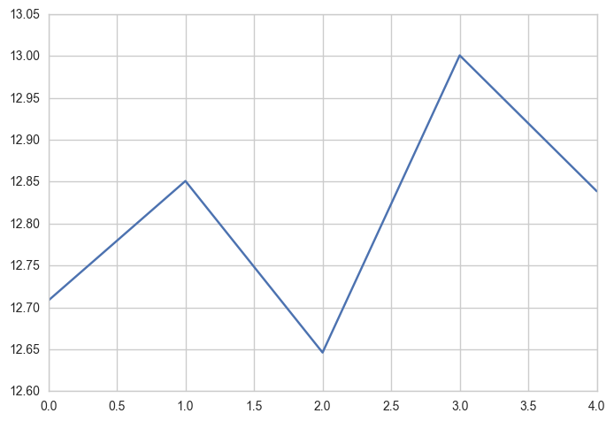


### Final Solution


```python
SeptData5 = SeptData
SeptData5.index = SeptData5['lpep_pickup_datetime']

```


```python
Means = SeptData5.resample('W').mean()
Variance =  SeptData5.resample('W').var()
STD =  SeptData5.resample('W').std()
```


```python
Means['Average_Speed']
```


    lpep_pickup_datetime
    2015-09-06    13.262654
    2015-09-13    12.593009
    2015-09-20    12.598962
    2015-09-27    13.054054
    2015-10-04    12.405383
    Freq: W-SUN, Name: Average_Speed, dtype: float64


```python
Variance['Average_Speed']
```


    lpep_pickup_datetime
    2015-09-06    30.261631
    2015-09-13    29.728275
    2015-09-20    28.245477
    2015-09-27    29.978925
    2015-10-04    27.884875
    Freq: W-SUN, Name: Average_Speed, dtype: float64


```python
STD['Average_Speed']
```


    lpep_pickup_datetime
    2015-09-06    5.501057
    2015-09-13    5.452364
    2015-09-20    5.314647
    2015-09-27    5.475301
    2015-10-04    5.280613
    Freq: W-SUN, Name: Average_Speed, dtype: float64


### Analysis

Here I replicated what I did up in another two lines of code. From here I would then do a two way ANOVA if I had more time, looking at the datapoints it does seem like they were all similar. there doesn’t seem to be much between group variance. It really doesn’t mean much without the ANOVA stats. The means do all look relatively similar.

## Part 3

I spoke about this a bit earlier but it appears as if there is a spike average speed starting around 6 o clock and ends up peaking at about 5am. I think a lot of this can explained by the reduction of cars on the road after prime communing hours. If I had more time I would like to look into the average location of each trip during the slower hours versus the faster hours. Id bet the taxis primarily drive in congested areas between 8-5 and are more like to get trips to the suburbs during nonpeak hours. I’m not sure if I’m entirely connived by that large peak at 5 am, I think there is something a bit fishy about that and Id love to spend more time with it.


```python
TripInfo.plot(x = 'Time of Day'); plt.legend(loc='best')
```


    <matplotlib.legend.Legend at 0x292097562e8>


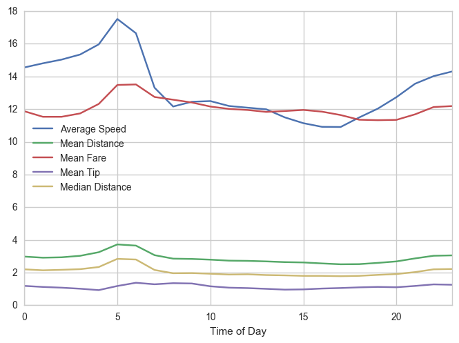


- In order to calculate this chart below I change the code I used in question 3 part 1 to accommodate an average speed variable.


```python
TripInfo

```


<div>
<table border="1" class="dataframe">
  <thead>
    <tr style="text-align: right;">
      <th></th>
      <th>Average Speed</th>
      <th>Mean Distance</th>
      <th>Mean Fare</th>
      <th>Mean Tip</th>
      <th>Median Distance</th>
      <th>Time of Day</th>
    </tr>
  </thead>
  <tbody>
    <tr>
      <th>0</th>
      <td>14.551381</td>
      <td>2.979385</td>
      <td>11.873207</td>
      <td>1.185860</td>
      <td>2.200</td>
      <td>0</td>
    </tr>
    <tr>
      <th>1</th>
      <td>14.805915</td>
      <td>2.912099</td>
      <td>11.532851</td>
      <td>1.121383</td>
      <td>2.140</td>
      <td>1</td>
    </tr>
    <tr>
      <th>2</th>
      <td>15.032147</td>
      <td>2.936125</td>
      <td>11.532671</td>
      <td>1.076864</td>
      <td>2.170</td>
      <td>2</td>
    </tr>
    <tr>
      <th>3</th>
      <td>15.343678</td>
      <td>3.026731</td>
      <td>11.738691</td>
      <td>1.013078</td>
      <td>2.210</td>
      <td>3</td>
    </tr>
    <tr>
      <th>4</th>
      <td>15.965009</td>
      <td>3.246530</td>
      <td>12.318851</td>
      <td>0.927399</td>
      <td>2.340</td>
      <td>4</td>
    </tr>
    <tr>
      <th>5</th>
      <td>17.517000</td>
      <td>3.723624</td>
      <td>13.481594</td>
      <td>1.179836</td>
      <td>2.840</td>
      <td>5</td>
    </tr>
    <tr>
      <th>6</th>
      <td>16.645588</td>
      <td>3.650691</td>
      <td>13.512351</td>
      <td>1.377299</td>
      <td>2.800</td>
      <td>6</td>
    </tr>
    <tr>
      <th>7</th>
      <td>13.311972</td>
      <td>3.066363</td>
      <td>12.745385</td>
      <td>1.284122</td>
      <td>2.160</td>
      <td>7</td>
    </tr>
    <tr>
      <th>8</th>
      <td>12.161149</td>
      <td>2.852871</td>
      <td>12.577758</td>
      <td>1.352084</td>
      <td>1.960</td>
      <td>8</td>
    </tr>
    <tr>
      <th>9</th>
      <td>12.452123</td>
      <td>2.834540</td>
      <td>12.408518</td>
      <td>1.333063</td>
      <td>1.970</td>
      <td>9</td>
    </tr>
    <tr>
      <th>10</th>
      <td>12.494802</td>
      <td>2.791001</td>
      <td>12.159538</td>
      <td>1.161746</td>
      <td>1.930</td>
      <td>10</td>
    </tr>
    <tr>
      <th>11</th>
      <td>12.194645</td>
      <td>2.731115</td>
      <td>12.015271</td>
      <td>1.077350</td>
      <td>1.880</td>
      <td>11</td>
    </tr>
    <tr>
      <th>12</th>
      <td>12.089953</td>
      <td>2.717525</td>
      <td>11.948825</td>
      <td>1.050660</td>
      <td>1.895</td>
      <td>12</td>
    </tr>
    <tr>
      <th>13</th>
      <td>11.991026</td>
      <td>2.684440</td>
      <td>11.831550</td>
      <td>1.005803</td>
      <td>1.850</td>
      <td>13</td>
    </tr>
    <tr>
      <th>14</th>
      <td>11.497460</td>
      <td>2.641293</td>
      <td>11.884384</td>
      <td>0.957232</td>
      <td>1.830</td>
      <td>14</td>
    </tr>
    <tr>
      <th>15</th>
      <td>11.141412</td>
      <td>2.620725</td>
      <td>11.951799</td>
      <td>0.971829</td>
      <td>1.800</td>
      <td>15</td>
    </tr>
    <tr>
      <th>16</th>
      <td>10.918532</td>
      <td>2.560685</td>
      <td>11.846962</td>
      <td>1.024360</td>
      <td>1.800</td>
      <td>16</td>
    </tr>
    <tr>
      <th>17</th>
      <td>10.908891</td>
      <td>2.508784</td>
      <td>11.640556</td>
      <td>1.055586</td>
      <td>1.780</td>
      <td>17</td>
    </tr>
    <tr>
      <th>18</th>
      <td>11.492727</td>
      <td>2.518237</td>
      <td>11.352815</td>
      <td>1.096303</td>
      <td>1.800</td>
      <td>18</td>
    </tr>
    <tr>
      <th>19</th>
      <td>12.032342</td>
      <td>2.593936</td>
      <td>11.325131</td>
      <td>1.123594</td>
      <td>1.860</td>
      <td>19</td>
    </tr>
    <tr>
      <th>20</th>
      <td>12.733721</td>
      <td>2.683526</td>
      <td>11.345157</td>
      <td>1.102870</td>
      <td>1.910</td>
      <td>20</td>
    </tr>
    <tr>
      <th>21</th>
      <td>13.555084</td>
      <td>2.867738</td>
      <td>11.682610</td>
      <td>1.182764</td>
      <td>2.030</td>
      <td>21</td>
    </tr>
    <tr>
      <th>22</th>
      <td>14.020976</td>
      <td>3.029568</td>
      <td>12.129948</td>
      <td>1.278653</td>
      <td>2.200</td>
      <td>22</td>
    </tr>
    <tr>
      <th>23</th>
      <td>14.307802</td>
      <td>3.053465</td>
      <td>12.189984</td>
      <td>1.256050</td>
      <td>2.220</td>
      <td>23</td>
    </tr>
  </tbody>
</table>
</div>


# Conclution

I am fairly happy with what I was able to accomplish in the allotted amount of time. The majority of these questions were more focused on cleaning than actual analytics. Question 1 was pretty straightforward and accomplished in a couple lines. Question 2 was also fairly simple. The histogram part was easy, the interesting part was creating a histogram that actually captured the data. This was done by cleaning the data. The ‘Trip Distance’ histogram ended up being very skewed, which makes sense because in a city like New York, many of the Taxi trips are shorter, I’m sure if you did the same thing with data from a place more spread out like San Diego, the results would be very different. Question 3 tripped me up a bit because I’ve never worked with date/time in python. All of the time series and data/time stuff I’ve done has been in R. I almost just exported the cleaned csv and then created a new markdown in R but I ended up deciding to push through. The median distances were all lower than the mean distances, meaning that there are a lot smaller Trip Distances and a few very large measurements, this is reflected again in the Histogram. Question 3 part 2 was a lot of fun. I ended up just creating that rectangle threshold for JFK. If I had more time I would definitely find a better method for doing this, maybe shapely or gmplot. A big drawback of larger datasets is runtime. 


Question 4 Was pretty straightforward. Percentage tip was calculated by dividing it by Total Fare and then multiplying by 100. I Then created a predictive model for it which had an R^2 of .96. I am very confident I would be able to improve this model, by reducing the number of variables and using a different regression algorithm (PCA/PLS/LASSO etc). Question 5 wasn’t too bad; the Average Speed variable was created by diving trip distance by trip duration. I wasn’t able to completely finished part two, I got caught up again on the data/time variables but it would have been nice to do a two-way ANOVA. Part 3 I had already created the code for in Question 3, so I just changed added the new ‘Average Speed’ variable and was able to get the metrics I wanted. If I had more time I would definitely take a closer look at the Average speed between 4am to 6am. Thanks for this opportunity, It was a great learning experience and definitely a lot of fun.

### Further Exploration

- So I mentioned how I didn’t trust the Average speed variable between 4-6, well I would like to break the data up by geographical areas and see which is contributing the most to those higher speed. Maybe there is a certain area that enables Taxis drivers to move faster during those times.

- I think it would also be interesting to check to see if any of the Green cabs were picking up customers in the yellow zones via street hails, this could be done the same was as I did the airport pickup. Regarding the airport pickups, I think it would be cool to model average speed to the airport vs average speed going back to New York, I think that would be a really interesting visualization. 

- I also think it would be interesting to do a cyclical decomposition of the Mean Speed variable to see how much of the day of the week factors into trip speed. 


